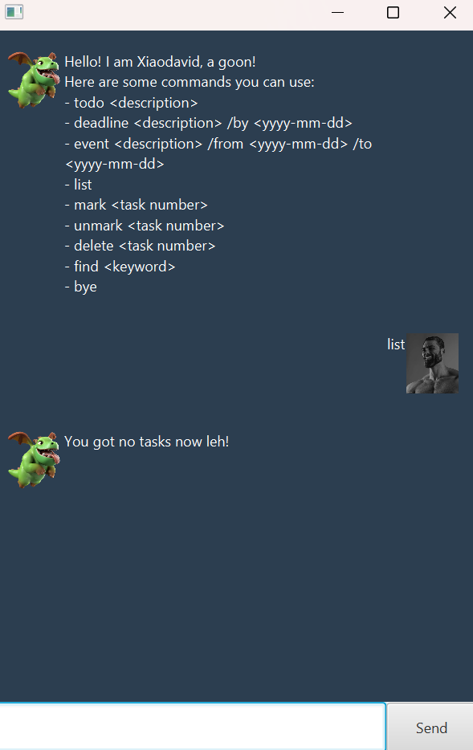

# Xiaodavid User Guide



## Getting Started
1. Launch the application (`./gradlew run` on macOS/Linux or `gradlew.bat run` on Windows).
2. Xiaodavid greets you with a list of commands you can use.
3. Type a command into the text box (or console) and press <kbd>Enter</kbd> to execute it.
4. Xiaodavid responds immediately and the task list is updated on screen.

All tasks are saved automatically in `tasks.txt` located in the same folder as the application. The file is created the first time you run the app.

## Feature Summary
| Command | Description                                               |
|---------|-----------------------------------------------------------|
| `list` | Shows every task currently tracked.                       |
| `todo DESCRIPTION` | Adds a todo task.                                         |
| `deadline DESCRIPTION /by YYYY-MM-DD` | Adds a deadline that must be completed by the given date. |
| `event DESCRIPTION /from YYYY-MM-DD /to YYYY-MM-DD` | Adds an event that spans the given dates.                 |
| `mark INDEX` | Marks the task at the given number as done.               |
| `unmark INDEX` | Marks the task at the given number as not done.           |
| `delete INDEX` | Removes the task at the given number.                     |
| `find KEYWORD` | Searches for tasks containing the keyword.                |
| `bye` | Shows a goodbye message.             


Each command listed below explains the expected format and response in more detail.

## Listing Tasks

Use `list` to display all tasks along with their status icons:

```
list
```

If there are no tasks yet, Xiaodavid cheerfully lets you know that your list is empty. Otherwise, tasks are numbered starting from 1, which is important for commands that refer to task indexes.

## Adding Todos

Creates a basic task with only a description.
```
todo buy milk
```
Xiaodavid confirms the addition and reports the total number of tasks tracked.

## Adding Deadlines

Creates a task with a due date. The date must follow the ISO format `YYYY-MM-DD`.

```
deadline CS2103 assignment /by 2025-02-28
```

The confirmation includes the task details and the current task count. If the date format is wrong or the description is missing, Xiaodavid explains what needs fixing.

## Adding Events

Creates a task that spans from one date to another. Both dates must use the `YYYY-MM-DD` format and the command must include both `/from` and `/to` sections.

```
event hackathon /from 2025-03-10 /to 2025-03-12
```

Xiaodavid repeats the event details to confirm it was added successfully.

## Marking and Unmarking Tasks

Mark a task as done using `mark`, or undo it with `unmark`. The task number corresponds to the ordering shown in `list`.

```
mark 2
```

```
unmark 2
```

If you provide an invalid index, Xiaodavid reports the problem without changing your list.

## Deleting Tasks

Remove a task permanently with `delete` followed by its number.

```
delete 3
```

The reply confirms the removal and the updated number of tasks remaining.

## Finding Tasks

Search for tasks whose description contains a keyword (case-insensitive) with `find`.

```
find cs2103
```

Xiaodavid lists the matching tasks. If none are found, you will be told so.

## Saving Your Work

Every time you add, edit, or delete a task, Xiaodavid saves the entire list to `tasks.txt`. The next time you launch the application, your tasks are reloaded automatically. There is no need for a manual save command.


Wrap up your session with `bye`.

```
bye
```

Xiaodavid bids farewell with a signature goon message. Until next time!